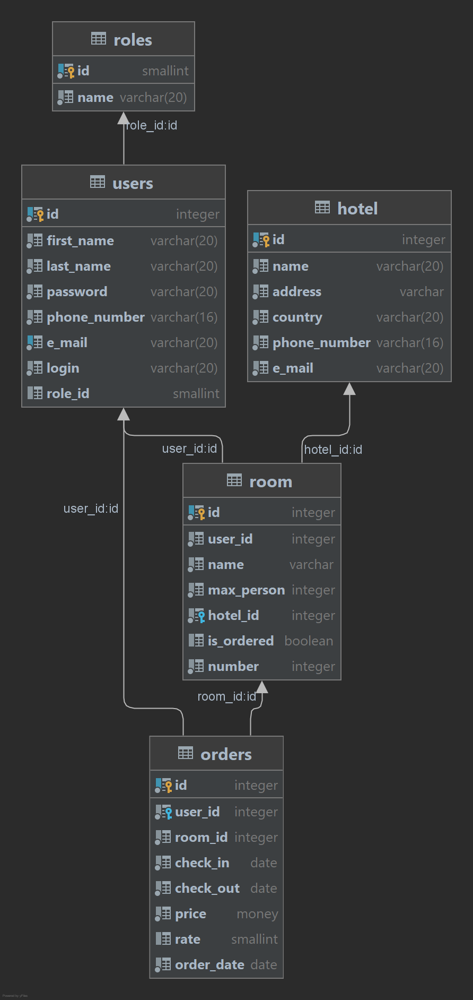

# Hotel

Hotel booking is an application in which the user can book a hotel, 
view information about hotels.
___
##Actors 
* Admin
* Users
___
## Use case 
1.User can sign up and sign in,
has access to all information on the site.  
2.Admin can sign in  
3.Admin can add hotel to system 
4.Admin can add,edit and remove room from system
5.Admin can view all sign up users

___

## Components used for the project:

1.Java 15   
2.Maven     
3.Git   
4.JavaEE: Servlet, JSP  
5.Server / Servlet container: Tomcat 9  
6.Database: Postgresql  
7.JDBC
8.HTML, CSS     
9.Logger: Log4J

##Database diagrams 
